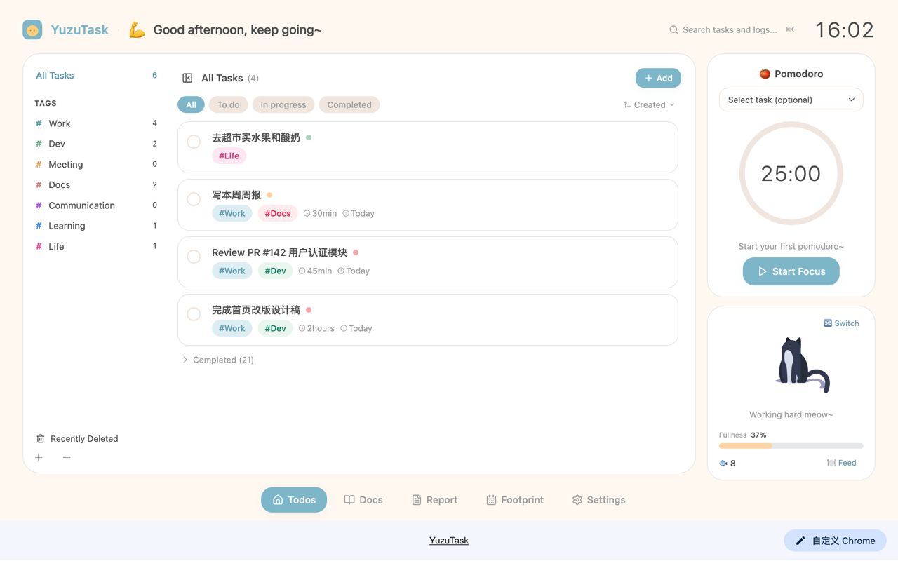
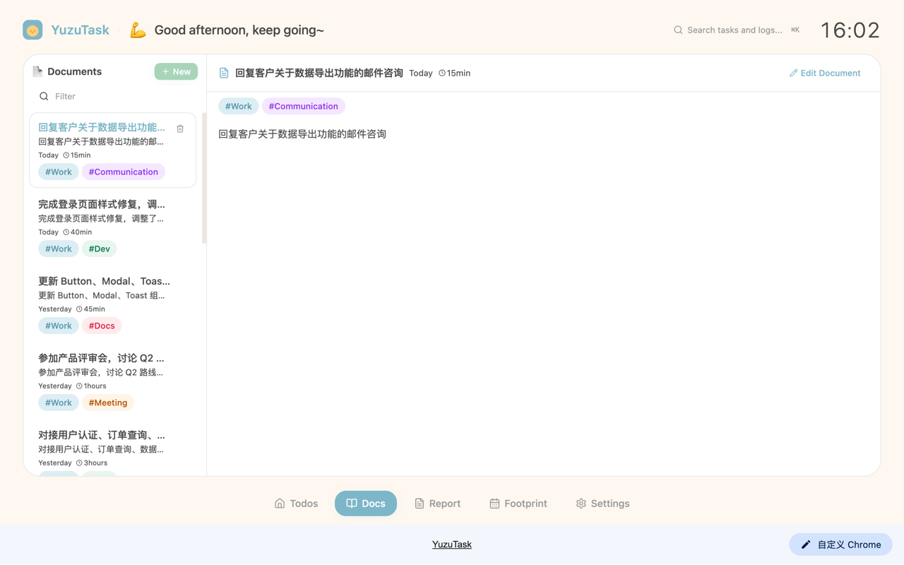
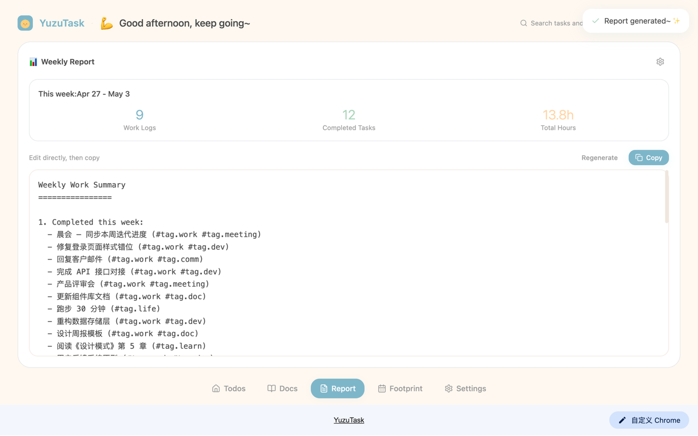
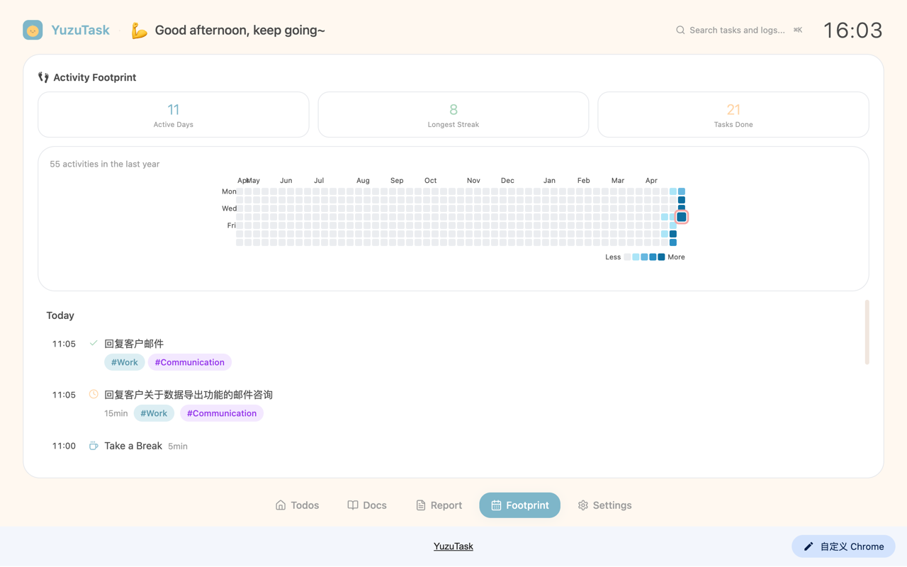
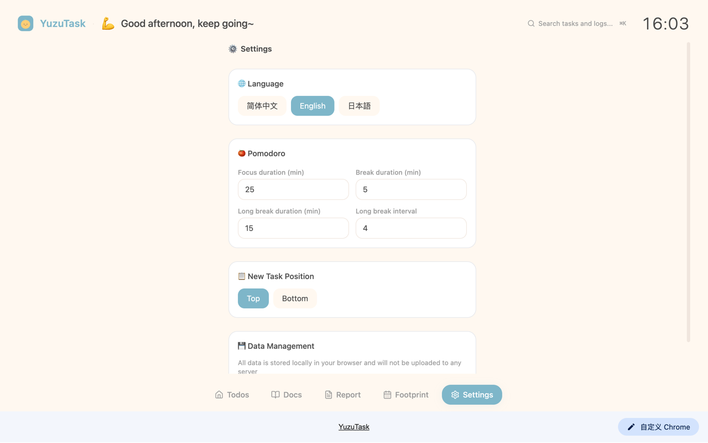

# YuzuTask

> 日系清新风 Chrome 新标签页插件 — 任务管理、番茄钟、工作记录、周报生成、足迹追踪，你的专属轻量工作台。



***

## 🌟 核心亮点

- 🎨 **日系治愈设计**：柔和马卡龙配色，温暖质感，每次打开新标签页都有好心情
- 📦 **开箱即用**：所有数据存储在本地浏览器，无需服务器，无需注册登录
- ⚡ **功能完整**：任务清单 + 番茄专注 + 工作记录 + 自动周报 + 足迹追踪，一站式搞定日常工作管理
- ✨ **灵动交互**：丰富的微动画和流畅的操作体验，效率工具也能很可爱
- 🌍 **多语言支持**：中文 / English / 日本語

***

## ✨ 主要功能

| 功能模块 | 描述 |
| --- | --- |
| **任务清单** | 支持优先级、自定义标签、截止日期，任务状态流转：待办 → 进行中 → 已完成 |
| **番茄钟** | 25分钟专注 + 5分钟休息，可自定义时长，支持关联任务，专注记录自动同步 |
| **工作记录** | 手动 / 自动记录工作内容，支持列表 / 日历双视图，自动统计工时 |
| **周报生成器** | 一键汇总本周工作记录和任务完成情况，自动生成结构化周报，可直接复制使用 |
| **足迹追踪** | 可视化活动热力图，追踪每日任务完成、番茄钟和工作记录的时间线 |
| **智能提醒** | 番茄钟结束提醒、周报生成提醒，不错过重要节点 |
| **数据全本地化** | 所有数据通过 `chrome.storage.local` 存储，隐私安全有保障 |

### 页面预览

| 任务清单 | 工作记录 |
| --- | --- |
|  |  |

| 周报生成 | 足迹追踪 | 设置 |
| --- | --- | --- |
|  |  |  |

***

## 🎨 设计风格

- 主色调：雾蓝 `#7EB6C9` + 樱花粉 `#F5A7A7` + 薄荷绿 `#A8D5BA` + 奶油橘 `#FFD4A5`
- 视觉风格：简约线条图标，柔和阴影，毛玻璃效果，日系文具温暖质感
- 交互：丰富的弹性动画和微交互，操作流畅有反馈

***

## 📦 安装使用

### 方式 1：Chrome 应用商店安装（推荐）

> 即将上架，敬请期待

### 方式 2：源码构建安装

```bash
# 1. 克隆项目
git clone https://github.com/rodickmini/YuzuTask.git

# 2. 安装依赖
npm install

# 3. 构建生产包
npm run build
```

构建完成后：

1. 打开 Chrome 浏览器，访问 `chrome://extensions/`
2. 开启右上角「开发者模式」
3. 点击「加载已解压的扩展程序」，选择项目下的 `dist/` 目录
4. 打开新标签页即可使用

***

## 🛠️ 技术栈

- **框架**：React 18 + TypeScript
- **构建工具**：Vite
- **样式**：Tailwind CSS
- **动画**：Framer Motion + Lottie
- **图标**：Lucide React
- **国际化**：i18n（中 / 英 / 日）
- **日期处理**：date-fns
- **存储**：chrome.storage.local
- **插件规范**：Manifest V3

***

## 📁 项目结构

```
YuzuTask/
├── src/
│   ├── background/       # 后台服务逻辑
│   ├── components/       # 通用组件
│   │   ├── footprint/    # 足迹追踪页
│   │   ├── layout/       # 布局组件（侧边栏、底栏）
│   │   ├── pomodoro/     # 番茄钟组件
│   │   ├── task/         # 任务列表组件
│   │   ├── ui/           # 通用 UI 原子组件
│   │   ├── weekly/       # 周报生成组件
│   │   └── worklog/      # 工作记录组件
│   ├── constants/        # 常量配置
│   ├── hooks/            # 自定义 Hooks
│   ├── i18n/             # 国际化（中/英/日）
│   ├── newtab/           # 新标签页主入口
│   ├── services/         # 业务逻辑服务层
│   ├── store/            # 状态管理（React Context）
│   ├── styles/           # 全局样式
│   ├── types/            # TypeScript 类型定义
│   └── utils/            # 工具函数
├── public/               # 静态资源（图标、音效）
├── docs/                 # GitHub Pages 文档
├── publish/              # 上架材料（截图、描述、隐私政策）
├── manifest.json         # Chrome 扩展配置
└── package.json
```

***

## 🔒 隐私政策

YuzuTask 不收集任何用户数据。所有数据均保存在浏览器本地。

详见：[隐私政策](https://rodickmini.github.io/YuzuTask/privacy-policy.html)

***

## 🤝 贡献

欢迎提交 Issue 和 PR！如果你有好的想法或发现 Bug，欢迎一起改进。

***

## 📝 许可证

MIT License © 2024-2025 YuzuTask
